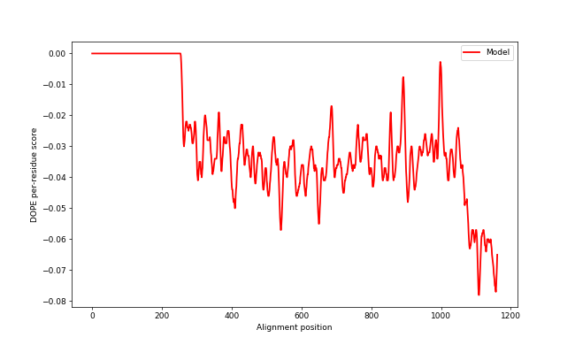
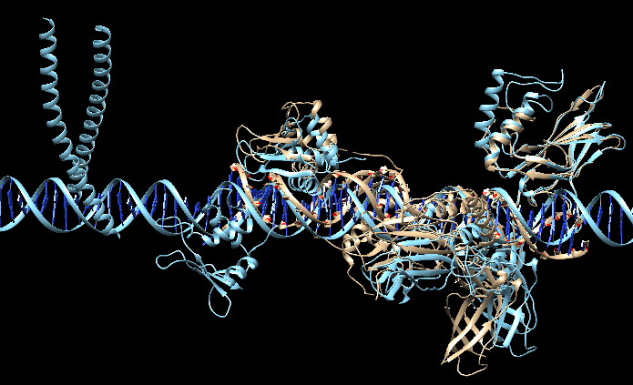

**TheChosenModel**
=================
*by* CANALDA BALTRONS, Aleix and DÍAZ ROS, Maria
---

# Introduction

We have developed a program called TheChosenModel to model the macro-complex structure of biomolecules, including proteins and DNA, using as an input the sequences of the pair interactions of the complex. This manual will include a tutorial explaining how to use the program using some examples, a theoretical explanation of the algorithm and the biological background behind it and, lastly, an analysis of the results of some examples, to assess the quality of the solutions our program offers.

# Tutorial

## Software Requirements

To be able to run the program smoothly and correctly, there are certain requirements that need to be met:

 * Python version 3.6

The following python modules:

 * Argparse

 * Biopython

 * re

 * random

 * gzip

 * os

 * sys

In order to run the -e --energy argument:

 * Modeller version 10.1

 * pylab

## Download and Installation

You can download the package to start its use with the following code:

```{.sh}

git clone https://github.com/aleixcanalda/TheChosenModel.git
cd TheChosenModel

```
There should be a script called setup.py with which we will do the installation. Nevertheless, before doing so, we should make sure that we have the requirements described above, otherwise the installation won't work.

```{.sh}

sudo python3 setup.py install

```
## Command-line arguments

These are all the arguments that can be introduced to our program:

```{.sh}

  -h, --help            show this help message and exit

  -i INPUT_DIRECTORY, --input-directory INPUT_DIRECTORY
                        Directory containing the input PDB files

  -s STECHIOMETRY, --stechiometry STECHIOMETRY
                        Path to a file containing the stechiometry of the complex.

  -o OUTPUT_DIRECTORY, --output-directory OUTPUT_DIRECTORY
                        Directory where the output will be saved.

  -f, --force           Overwrite the content of the output directory.

  -v, --verbose         Print the progession of the execution.
  
  -e, --energy          Calculate DOPE energy and plot the result.
  
  -t --template-DNA     DNA template for models with only protein-DNA interactions.
   
  -m --models           Number of resulting models.
```

### Input (mandatory argument)

As we can see above, the input has to be a directory containing only PDB files. These files have to include two interacting chains from the model and the name of each file has to follow a set structure. For protein-protein interactions the structure is: protein1_protein2.name_chain1_chain2.pdb(.gz) where protein1 is an alphanumerical string that will be used to identify the stechiometry of the structure, the name is an alphanumerical string (name of the complex) and the chains must coincide with the IDs of the chain IDs inside the file. As it can be seen, the PDB files can either be compressed or not. Additionally, there is the option of introducing input files with DNA interactions following this structure (when there is a combination of protei-protein and protein-DNA interactions). Then, instead of protein2 being any string, it will  put "DNA" to indicate that it's a DNA strand and chain2 will still be the chain ID inside the PDB file.

Example of input files for the protein macrocomplex 1GZX:

P69905_P68871.1gzx_A_B.pdb

P69905_P69905.1gzx_A_C.pdb

P69905_P68871.1gzx_A_D.pdb

For the cases with DNA-protein interactions exclusively (there are no protein-protein interactions) the structure is: protein.DNA.name_chain1_SenseAntisense.pdb(.gz). The protein is also an alphanumerical string that will be used to identify the stechiometry of the structure, then DNA to identify that it's a protein-DNA interaction and the name of the structure (name). Chain1 is the ID of the protein chain and it must coincide with the chain ID inside the file. SenseAntisense are the IDs of the two strands of DNA and they must coincide with the ID inside the file.

Example of input files for protein-DNA interactions (from the macro-complex 2O61):

P05412.DNA.1t2k_C_EF.pdb

Q04206.DNA.5u01_A_EF.pdb

### Stechiometry

The stechiometry is a .txt file that must contain a line for each protein using the same nomenclature used in the input files and it will indicate how many times the protein has to appear in the final model. Example of an stechiometry file:

P69905:2

P68871:2

### Output directory (mandatory argument)

If the directory doesn't exist, it will be created automatically but if the user introduces an already existing directory, it will raise an error unless he specifies that he wants to overwrite the content (using the -force argument).

### Energy
It calculates the DOPE score for each model and it builds a DOPE profile used to create a plot of the DOPE score along the sequence. To use this argument is necessary to have the modules of modeller and pylab installed.

### Template DNA
It is a mandatory argument when the model consists only of protein-DNA interactions that form a long strand of DNA where the proteins interact. The input is the path to a file containing the both strands of a DNA sequence as a PDB file.

## Examples

Our first example will be with the protein macro-complex of the oxy T state of haemoglobin, with the PDB ID **1GZX**. This is a structure made with X-ray diffraction with a resolution of 2.10 Å. The structure was deposited by the authors in 2002 from their paper about the T state haemoglobin (Paoli et al., 1996).

To create the complex running TheChosenModel in the terminal, the following code has to be executed:

```{.sh}

TheChosenModel.py -i home/examples/example1/1gzx/ -o home/examples/results/1gzx -f -v -e

```
With this line what we are doing is giving as input (-i) the path to a folder containing the pairs of chain interactions that will form the macro-complex 1GZX (correct naming structure explained in the input argument section), the path to the output folder where we want to store the results (-o) and, if this folder already exists, we'll overwrite it (-f). Also, we will show on the terminal the different steps that the program is going through, to keep track of the process, with the verbose argument (-v). And lastly, we will calculate the energies of the resulting model as well as its energy profile.

The final result of the model can be seen in the Analysis section of this document.

The other example we will show is the macro-complex with a PDB ID **2O61**. This complex is the crystal structure, obtained with X-ray diffraction, of NFkB, IRF7 and IRF3 bound to the interferon-b enhancer. The resolution of the complex is 2.80 Å and it was deposited into the database in 2006 by the authors of a paper about the activation of the interferon beta (IFN-beta) gene. Its activation requires an assembly of an enhanceosome containing ATF-2/c-Jun, IRF-3/IRF-7, and NFkappaB. (Panne et al., 2007)

This macro-complex is formed solely by DNA-protein interactions so, in order for the program to work, it is necessary to add a DNA template that will help with the superimposition process. The commands used to run the example are:

```{.sh}

TheChosenModel.py -i home/examples/example2/2O61/ -o home/examples/results/2O61 -t home/examples/example2/template_file.pdb -m 4 -e -s home/examples/example2/stechiometry_file.txt

```
With this line what we are doing is first giving as input (-i) the folder containing the chain interactions that will form the macro-complex 2O61 and the output folder where we want to store the results (-o). Also, we will send the template ("template_file") for the DNA (-t), we will receive four different models (-m 4) and calculate the DOPE energy for each of them. Lastly, the path to an stechiometry file is provided (-s, required syntax for the stechiometry explained in the stechiometry argument section) and the program will try to satisfy it the best it can. The final result of this model can be seen in the Analysis section of this document.

# Algorithm

In this section, the algorithm that the program uses will be explained step by step. The program starts by processing the arguments provided by the user which are, at the bare minimum, the required input and output directory. It performs a necessary check to ensure that both the input files and the stechiometry file (if provided) have the correct structure, otherwise it will raise the appropiate error. Then, the program uses a function called **all_chains** to create a list containing all the interactions corresponding to the input files. The interactions are saved in pairs in the case of proten-protein interactions and in trios in the case of protein-DNA interactions, where there are the two complementary strands of DNA to take into account. This function also creates a dictionary to keep the information of which protein each chain belongs to, which is going to be helpful in further steps. In both cases, the chains are saved as an object of a self-developed class (**MyChain**), that is a child of the Chain class of the Bio.PDB.Chain module, created in order to include some extra functions that will be useful throughout the program.

Once all the chains are included inside a list, the next step is discovering all the interactions among the chains (whether provided as an input file or not). This is done by a function called **get_interactions_dict** and it creates a dictionary with all the interacting chains. From here, the program will start the main function to generate the model and it diverges into two functions, depending on whether the user has provided a template DNA (**template_loop**) or not (**main_loop**). The two possibilities will be explained separately for better clarity in the following sections.

## Main_loop

This is the main function of the program when there is no template DNA and it builds the core of the model where the rest of the chains will be added on in an iterative fashion.

First of all, the function calls another function named **parse_stech** to extract information about the stechiometry file (if provided by the user) and save it in a dictionary. There are also some other dictionaries that will be created in order to control the stechiometry throughout the loop. Then, the starting model that will act as the core to start superimposing the chains and it will be selected thanks to the function **start_model**. The starting model will consist of an interacting pair of proteins that can be found in one of the input PDB files. To decide the pair, first the chain with the largest number of interactions is chosen and then, using the interactions dictionary previously created, the second chain of the starting model is selected. This way, it ensures that the chosen starting model has a chain interacting with various other chains, making the process of searching for interactions and adding the new chains onto the structure more efficient. Moreover, by doing so it can avoid the selection of a starting chain that doesn't present any interactions at all. Once a starting model has been chosen, it's saved in an object of the class Model from the Bio.PDB.Module module, where the following chains being added will be introduced inside this object.

At this point, the main loop of the program begins, going through all the interactions and trying to superimpose one chain at a time using the interactions dictionary to find the interactions between the new chain being added and the chains already in the model in an iterative fashion. When an interaction is found and the two chains necessary for the superimposition are located, first a function called **equal_length_chains** will check that the two chains have equal length (a mandatory requirement to do the superimposition). Then, the program uses a function called **superimpose** that employs the Bio.PDB.Superimposer module to superimpose two identical subunits (chains that have at least 95% similarity), and along with them, its respective interacting chain by applying to it the transformation matrix created with the superimposition of the two identical subunits. For instance, if the model contains an interaction (A-B) and then chain C has to be added, a pair of interacting chains is supplied (in this case, A-C). Then the function will be able to superimpose A-A, creating a transformation matrix that will be applied to C in order to obtain the structure with the 3 chains, as shown in Figure 1.


Before adding the superimposed chain to the model, the presence of clashes with the rest of the model has to be assessed, in order to decide whether to add the chain to the model or not. To that end, the **superimpose** function calls the function **clashes** to calculate the amount of clashes using the Bio.PDB.NeighborSearch module, that analyzes if some of the atoms of two chains are too close to each other. If more than 5% of the atoms are at a distance shorter than 2 Armstrongs, it is considered a clash and the chain will not be added to the model. If this is the case, then the function will try to superimpose the current chain using another one of its interactions and it will keep repeating until it can fit in the chain without clashes. If, after trying with all possible interactions, it can not be properly introduced, the chain won't be added to the model and the user will be made aware of it if the verbose argument was requested.

After this, the first iteration of the loop is finished and in the next iteration the process will start again with a new chain. Nevertheless, at the beginnig of each iteration, the stechiometry is checked. If the number of proteins in the model corresponding to the type of the current protein is already the number indicated in the stechiometry file, no more will be added and the loop will proceed to the next iteration.

## Template_loop

This function will be executed if the user has provided a template for the DNA. The function starts the same way as the **main_loop**, calling the **parse_stech** and the **start_model** functions. In this case, the **start_model** function will automatically use this template as a starting model and it will be introduced inside an object of the class Model. Here, to fit the protein onto the model, the fragment of the DNA that is interacting with the protein will be used. As it was mentioned before, the superimposition has to be done with two chains or strands of the same length, so the fragment of DNA can not be superimposed directly onto the template DNA. Therefore, the program uses clustal to align the the two DNA sequences and grab only the part of the template corresponding to the site interacting with the current protein being added. Once this is done, the program proceeds in a similar manner as the **main_loop**, using the **equal_length_chains** and the **superimpose** functions.

&nbsp;

Both of these main functions (main_loop or template_loop) will be called only once by default to obtain only one model, but if the user specifies the number of final models he wishes for, the functions will be called as many times as models are needed. After each model is finished, the function **save_PDB** will be called and it will create a file inside a folder called "structures" inside the output directory requested.

Lastly, there will be an assessment of the energy of the models if the user so indicates in the execution. This assessment is made by the function **DOPE_Energy** and it consists on the calculation of the DOPE energies of the models using modeller. This creates a profile file that contains the energy information for the whole model (named modelX.profile) and another file (named modelX.DOPE) where the standard output automatically created by the program is stored. This second file can contain some errors that are not to be noticed and at the end of it, the DOPE score is notated. Finally, to make it more simple and visual for the user, the program calls the function **get_profile**, that creates an energy profile plot using Matplotlib that is saved in a .png image. All the files created by this function can be found on the "analysis" folder inside the output directory indicated by the user.

## Analysis of the algorithm

This section is a discussion about the efficiency of the program and its cost. The part of the program that takes most time is the initial preparation. Before calling the main function, the program has to read and process all the input files one by one, creating new objects for each of them and introducing them inside some dictionaries and lists that will be used later on. This is the most costly step and the one that has the highest order of growth when the size of the input is increased. Fortunately, this preparation is only done once and then the actual building of the models is faster. Therefore, the growth of the algorithm regarding the number of models to create is linear, given that it is done using the main function in an iterative fashion (the main function is called as many times as models are needed).


# Biological background

In the last years there has been an exponential increase in the amount of proteins being sequenced. It is known that the function of a protein can be discovered thanks to its structure, hence the modeling of proteins has become a major challenge in the field. Moreover, proteins often tend to form networks of physical interactions with other biomolecules, such as other proteins, DNA or RNA. Therefore, to assess more accurately the function of a certain protein, it is necessary to discover its interactions (Fornes et al., 2014). PPIs (Protein-Protein Interactions) consist of physical contacts between proteins that occur in a cell or a living being, so they don't include other relationships with an absence of physical contact or generic contact produced by production or degradation. The complete set of interactions that a living being has it's the interactome and it can be a measure of how complex an organism is (Garcia-Garcia et al., 2012).

To fully understand how protein interactions occur, it's not enough to know the biomolecules involved in the process, the high-resolution molecular/atomic details are also needed. However, the number of proteins with a known structure in the Protein Data Bank (PDB) is very low in comparison to the number of discovered sequences and it's even lower for protein complexes (Mosca et al., 2014). This imbalance has prompted the development of strategies to model the structure of proteins and its interactions. There are a good amount of methods that can detect PPIs and they provide different amounts of detail. The methods can be classified between low or high-throughput methods and between experimental (Yeast Two Hybrid, X-ray crystallography or NMR spectroscopy) and computational (such as comparative modeling or docking) (Garcia-Garcia et al., 2012).

Computational methods to predict PPIs use experimental data to predict new PPIs and there are several different approaches. The interactions can be modeled using template complexes of homologs, by assuming that the homologs of interacting proteins also interact in a similar fashion. However, the conservation the of the interaction would depend on the conservation of the interface between the interacting biomolecules, although in general it has been shown that residues at the interface tend to be structurally conserved (Espadaler et al., 2005). Sometimes, they can also be built superimposing the models of unbound partners over a template complex. Another strategy would be docking the structure of one of the two proteins onto the other (Fornes et al., 2014).

## Macrocomplexes

As it was explained, proteins interact with each other and hydrophobicity, hydrogen bonds and van der Waals forces play an important role in role in the determination of the structure (Chanphai et al., 2015). It has been determined that the limits used for detecting hydrogen bonds are between 2.4 and 3.5 Armstrongs (Eswar et al., 2000). Thus in the program TheChosenModel, the proteins were deemed as interacting when the distance between the atoms of the two chains was 3.5 A or less, regardless of the existence of a file containing both proteins (in order to detect the interacting chains for all the complex, not only the interactions given as an input).

## Superimposition

As it was explained in the Algorithm section, a superimposition is done when a group of structures is translated and rotated so that the square root of the sum of squares of coordinate differences of the atoms in the structures (RMSD, root-mean-square deviation) is minimized (Wu et al., 2010).  This finally results in the addition of another protein to the building model. Following the example in the previous section (Figure 1), the model could include the chains A-B and it currently has to add the A-C interaction.

To do a superimposition it's necessary to have two lists of atoms of the same length (in the current example, two chains A). One will be a fixed list of atoms and the other is the one that will be moving. It's also necessary to stress the importance of having the same length in both lists, because the function will move each atom of the moving list towards the pair atom of the fixed list, therefore, the number of atoms must be the same.

The rotation of the moving list is done in such a way that the RMSD between the pairs of atoms of the two lists is minimized. This rotation that the moving atoms have to do is encoded in a translation matrix that will be applied to chain C. The interaction between A and C is known and also the interaction between A and B, so when the translation matrix is applied to C, it will rotate the exact way that the chain A had to rotate to superimpose with the chain A of the model, therefore, chain C will be fitted into the model.

## Clashes

After doing a superimposition, a possible interference between the new chain and the already created model/structure has to be taken into account. If the atoms between two different chains are closer than a normal interacting distance (as we established in the macrocomplexes section), it's considered a clash. A clash is defined as an unnatural overlap of any two non-bonding atoms in a protein structure and it has to be removed (Ramachandran et al., 2011).

To calculate if a clash is produced, the model obtains the atoms corresponding to the backbone of the structure. In the case of proteins, it uses the CA carbons (alpha carbons) and in the case of DNA it uses the C1 carbons. If the backbone atoms are in contact with each other at a distance of less than 2 A and these clashes represent more than 5% of the structure it is considered a significant clash and the program will handle the situation (Batsanov, 2001).

## DOPE

After obtaining several models for a protein macrocomplex, it is vital to estimate the quality of the predictions to be able to assess if the model has the correct fold, if there are errors in a certain part of the structure and also to determine the best model produced (Fornes et al., 2014).

The native structure has the lowest energy of all possible structures in native conditions, hence a function to predict accurately the free energy would enable the analysis of the models. Unfortunately, this is not possible and the solution is to develop a score function whose global minimum also corresponds to the native structure of the protein. This scoring function is also called knowledge-based or statistical potential due to its dependence on known protein structures.

Tanaka and Scheraga (1976) managed to relate the frequencies of contact between different residue types, obtained from known native structures, to the free energies of corresponding interactions using the simple relationship between free energy and the equilibrium constant. Then, using the probability theory, an atomic distance-dependent statistical potential can be calculated from a sample of native structures that does not depend on any adjustable parameters (Discrete Optimized Protein Energy, DOPE). DOPE is based on an improved reference state that corresponds to noninteracting atoms in a homogeneous sphere with the radius dependent on a sample native structure.

The DOPE assessment method of the program gives as output a DOPE profile that can be inputed into a graphical program to create a plot for the profile. This plot has in the X axis the position of each residue and in the Y axis the DOPE score per residue. Laslty, it has to be taken into account that the score is unnormalized with respect to the protein size and has an arbitrary scale, therefore scores from different proteins cannot be compared directly.

# Asessment of the program

In this section there will be a global assessments of the strengths and weaknesses of TheChosenModel.

## Strengths

* Our program is capable of fully forming protein macrocomplexes from an input of pairs of interacting chains in said macrocomplex.

* It is capable of forming macrocomplexes that contain both protein-protein interactions and protein-DNA interactions, as well as using RNA data.

* It is able to compute multiple models for both protein-protein and protein-DNA interactions, in order to build different structures and increase the chance of obtaining a good model.

* With the stechiometry input, the user decides if they want to limit the number of proteins in the macrocomplex or provide multiple structures of the same protein and build different models, in order to find the best possible solution.

* Our program is able to calculate, if the user so wishes, the DOPE energy of the protein and give an energy profile to analyze whether the results are good, especially in those cases where RMSD calculation is not possible due to an absence of a template to asses the quality.

## Weaknesses

* The computational cost of our program increases with the amount of input files provided by the user, so when working with big macro-complexes, the number of possible comparisons increases as the core structure of the macro-complex gets bigger and so does the computational time of the program.

* Our program is able to compute various protein-DNA interactions (if the input files contain both DNA chains) only when using a DNA template.

* It is not able to compute macrocomplexes that have a series of protein-protein interactions and at the same time protein-DNA interactions, when the input files contain both DNA chains. If the input files are provided as in the case of protein-protein interactions (meaning that there are two files, one for protein1 interacting with one DNA strand and another for protein1 interacting with the complementary DNA strand), then it is possible to build the complex.

* When various fragments of a chain are given, our program does not complete the chain, but chooses randomly one fragment.

# Analysis

With our program we are able to analyze the DOPE energy of each model that we create with the optional argument "-e, --energy" and we obtain an energy profile for each model that uses MODELLER to obtain it on a window of 13 residues. The DOPE energy can be seen on the terminal screen. An energy that is very negative overall means that a good model was produced, whereas the less negative the energy, the worse the model is, which makes it easy to compare and find the model that is more suitable. 

Another way to analyze the model is, in those cases where the complete structure is available for download in the PDB, by superimposing with a program such as Chimera the model obtained with the complete known structure. By doing so, we can obtain the RMSD from this superimposition, where the smaller it is, being 0.00 the smallest value, the better the model. In this case, an RMSD of 0.00 would mean that the model is identical to the complete structure, so the reconstruction of the macrocomplex has been done perfectly.

With our examples, we decided to analyze the models both ways:

* **1gzx**. This macrocomplex corresponds to the oxy T state of the hemoglobin, obtained when oxygen is bound to all four chains. The main stechiometry is A2B2, corresponding to the alpha and beta chains of the protein, however the chains in the example are presented as A, B, C, D. After running it through our program we obtained a perfect reconstruction, with an RMSD of 0.000 between the 146 pruned atom pairs. The DOPE score of the model is -71488.671875 and it has a good energy profile, as seen in Figures 2 and 3.
  
  
* **6gmh**. This macrocomplex is the structure of an activated transcription complex Polymerase II. Its main stechiometry is a Hetero 20-mer, with 20 unique protein chains (with a global stechiometry of A1B1C1D1E1F1G1H1I1J1K1L1M1N1O1P1Q1R1S1T), and also 3 unique nucleic acid chains (2 DNA chains and 1 RNA), which are the chains that were available for our program. In this example it was also obtained an RMSD of 0.000 between the 1441 pruned atom pairs and a DOPE score of ... with a good profile as seen in Figures 4 and 5 (light brown for our model and blue for the template).
  
  
* **5nss**. This macrocomplex is the intermediate complex of the RNA polymerase-sigma54 holoenzyme with a promoter DNA and the transcription activator PspF. It's a hetero 12-mer with 6 unique nucleic protein chains (creating an A6B2C1D1E1F1 stechiometry) and 2 nucleic acid chains. It was obtained an RMSD of 0.000 between 1340 pruned atom pairs and a DOPE score of -408088.031250, with a profile as seen in the Figures 6 and 7 below (light brown for our model and blue for the template).
  
  
* **5fj8**. This macrocomplex is the yeast RNA polymerase III elongation complex. The global stechiometry is a Hetero 17-mer, containing 17 unique protein chains and 3 unique nucleic acid chains, one RNA and DNA molecules. The RSMD between the model and the complex is also 0.000 between 1422 pruned atoms pairs and the DOPE score -497916.468750, with the profile shown below in Figure 8 (light brown for our model and blue for the template).
  
  
* **2O61**. This macrocomplex is the crystal structure of NFkB, IRF7, IRF3 bound to the interferon-b enhancer. To build the complex, the files from the example provided in class were used. It was build using the stechiometry provided and also using as a template the interferon b enhancer DNA. 4 different models were build and the best model has a DOPE score of -85164.250000. Nevertheless, the model with the second best score (-83004.679688) has a better RMSD when compared with the PDB structure, with a value of 8.051 across all 546 atom pairs.
In the Figure X and Y we can see the DOPE profile and the visualisation with Chimera for the second best model and its superimposition with the 2O61 structure taken from the PDB (in blue our model and in light brown the template.

 
 
 


# References

Paoli M, Liddington R, Tame J, Wilkinson A, Dodson G. Crystal structure of T state haemoglobin with oxygen bound at all four haems. J Mol Biol. 1996 Mar 8;256(4):775-92. doi: 10.1006/jmbi.1996.0124.

Panne D, Maniatis T, Harrison SC. An atomic model of the interferon-beta enhanceosome. Cell. 2007 Jun 15;129(6):1111-23. doi: 10.1016/j.cell.2007.05.019.

Fornes O, Garcia-Garcia J, Bonet J, Oliva B. On the use of knowledge-based potentials for the evaluation of models of protein-protein, protein-DNA, and protein-RNA interactions. Adv Protein Chem Struct Biol. 2014;94:77-120. doi: 10.1016/B978-0-12-800168-4.00004-4.

Mosca R, Céol A, Stein A, Olivella R, Aloy P. 3did: a catalog of domain-based interactions of known three-dimensional structure. Nucleic Acids Research. 2014;42:D374-D379. doi: 10.1093/nar/gkt887

Garcia-Garcia J, Bonet J, Guney E, Fornes O, Planas J,Oliva B. Networks of ProteinProtein Interactions: From Uncertainty to Molecular Details. Mol Inf. 2012;31:342-362. doi: 10.1002/minf.201200005

Espadaler J, Romero-Isart O, Jackson RM, Oliva B. Prediction of protein–protein interactions using distant conservation of sequence patterns and structure relationships. Bioinformatics. 2005;21:3360-3368. doi: 10.1093/bioinformatics/bti522

P. Chanphai, L. Bekale, H.A. Tajmir-Riahi. Effect of hydrophobicity on protein–protein interactions. European Polymer Journal. 2015;67:224-231. doi: /10.1016/j.eurpolymj.2015.03.069.

Eswar N, Ramakrishnan C. Deterministic features of side-chain main-chain hydrogen bonds in globular protein structures. Protein Engineering, Design and Selection. 2000;13:227–238. doi: 10.1093/protein/13.4.227

Wu D, Wu Z. Superimposition of protein structures with dynamically weighted RMSD. J Mol Model. 2010 Feb;16(2):211-22. doi: 10.1007/s00894-009-0538-6.

Ramachandran S, Kota P, Ding F, Dokholyan NV. Automated minimization of steric clashes in protein structures. Proteins. 2011 Jan;79(1):261-70. doi: 10.1002/prot.22879.

Batsanov, S.S. Van der Waals Radii of Elements. Inorganic Materials. 2001;37:871–885. doi: 10.1023/A:1011625728803
